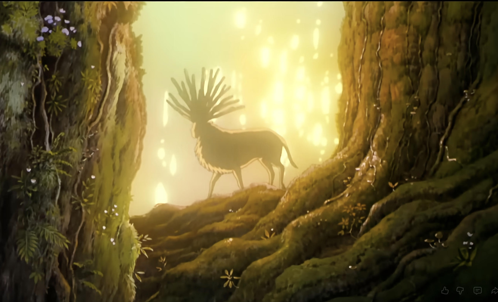
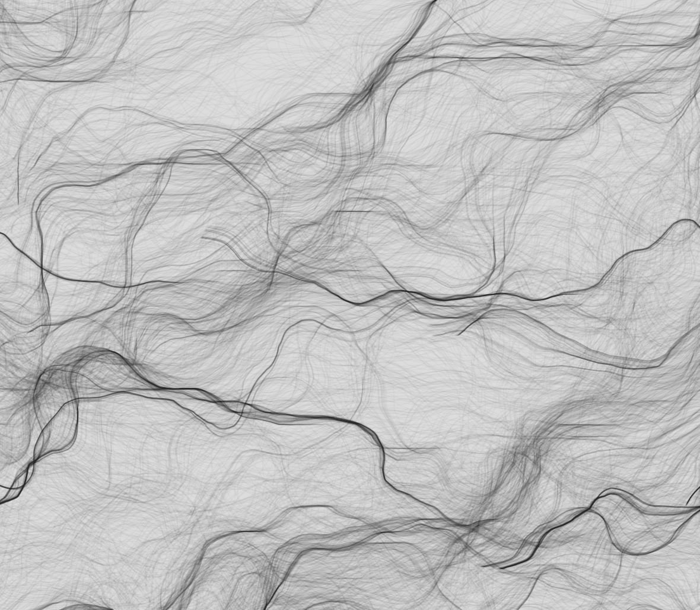

Creative coding major project repository

### Quiz 10 - Major Project Pitch

# The Living Landscape

## Part 1: Project Direction

**Project Path:** Original Artwork

### Vision & Inspiration

*The Living Landscape* is an interactive artwork in p5.js. It's a nature scene where the viewer's actions shape an ecosystem. Nurturing actions flourish it while damaging actions causes collapse.

Our primary inspiration is *Nomadic Tribe* by makemepulse (2019), an interactive experience showing how a natural environment can feel emotionally alive and responsive to user input. Another inspiration is Studio Ghibli's *Princess Mononoke* (1997) where every human action carries a lasting environmental consequence showing fragile balance between people and nature. Visually, the organic flowing motion of p5.js generative noise artworks (p5js.org) influenced our approach to animating the entire scene continuously, not just individual elements. Together these works define our direction - a living nature scene driven by interactivity.

---

### Inspiration Sources

#### 1. *Nomadic Tribe* by makemepulse (2019)
An interactive journey through an animated natural world. The way the environment feels alive and responsive even in stillness inspired our approach to a scene that breathes on its own.

[https://2019.makemepulse.com/](https://2019.makemepulse.com/)

---

#### 2. *Princess Mononoke* by Studio Ghibli / Hayao Miyazaki (1997)
Miyazaki's film depicts nature and human civilisation in fragile, consequential balance. Every action toward the forest has a visible, lasting effect on the world. This directly shapes our project's core concept.

[Princess Mononoke -  Trailer](https://youtu.be/4OiMOHRDs14?si=ACdBvhGvAndIO91N)

---

#### 3. *p5.js Noise & Generative Art Examples* by  p5js.org
Generative artworks demonstrating Perlin noise producing organic, living visual systems like flowing fields, terrain and particle motion inspires us how to think about animating our scene as a whole rather than element by element.

[p5.js Examples](https://p5js.org/examples/)

[Perlin Noise - Flow Field
by arthurrc](https://editor.p5js.org/arthurrc/sketches/Bya9WiAnm)

---

## Part 2: Mechanics

### User Input

The user input mechanic controls user interactions within the living landscape. Different forms of clicking will result in various behaviors of the ecosystem. A left-click plants a flower, while clicking and dragging scatters seeds across the terrain, leaving a trail of wildflowers that bloom after a short delay. Double-clicking a tree summons a bird’s nest, drawing birds to the branches and filling the scene with chirping audio. In addition, environmental behaviors will result from specific keypresses: R calls down rain, accelerating the growth of surrounding flowers, while X introduces damage, such as trees falling, water clouding with murk, and flowers wilting. Three consecutive X presses will also push the ecosystem into full collapse. As a result, each user action has a visible consequence, making them feel a great sense of responsibility for the ecosystem they are shaping. This directly reflects our theme of human choices carrying real, lasting impact on nature.

**p5.js functions:** `mousePressed()`, `mouseDragged()`, `doubleClicked()`, `keyPressed()`

(Angel Huang)

---

### Perlin Noise & Randomness

This mechanic makes the scene feel alive at all times. p5.js's `noise()` animates the entire world simultaneously- grass sways in coordinated wind motion, water ripples across noise-displaced vertices, clouds drift, rain particles follow winding paths and terrain has organic undulation. The `random()` function ensures every flower planted is unique- a different petal count, size, colour and stem curve each click. Noise and randomness together make sure the scene is never static and no interaction looks identical. This reflects nature's unpredictability inspired by the continuous textured motion of *Nomadic Tribe*.

**p5.js functions:** `noise()`, `noiseSeed()`, `random()`, `beginShape()`, `vertex()`

(Shweta Kamble)

---

### Time-Based

Time-based

The time-based mechanism would give the ecosystem its emotional rhythm, where each action triggers a cascading delay of actions and consequences, making the response feel more natural than instant. Like when you click a flow, the tree grows, and the river becomes clearer, or two after a few seconds. A health threshold would activate the project's wow moment, in which the sky would slowly transition to dusk, and fireflies would appear, growing in number with sustained positive interaction rather than being directly triggered. On the other hand, there's a destructive path: collapse unfolds gradually over many frames. Time transforms clicks into consequences and consequences into story, creating a world that grows and deteriorates at its own pace.

**p5.js functions:** `millis()`, `frameCount`, `lerp()`

(Rachel Seah)

---

### Audio

The audio mechanic is the ecosystem's emotional voice, reflecting its living state through layered nature sounds driven by frequency analysis. Using p5.sound's FFT analyser, the mechanic splits audio into frequency bands that drive visual elements directly. Bass frequencies pulse the river's water ripples; mid frequencies animate grass sway and canopy shimmer; treble frequencies generate glittering particles along the riverbank. The audio also responds to the ecosystem's health score. When thriving, rich birdsong and flowing water play and visuals feel vibrant. As health deteriorates, the soundscape strips back layer by layer. At collapse, a low drone takes over the audience hears the ecosystem dying before they see it.

**p5.js functions:** `loadSound()`, `p5.FFT()`, `fft.analyze()`, `fft.getEnergy()`, `p5.Amplitude()`, `amp.getLevel()`, `map()`, `song.play()`, `song.pause()`

(Nishant Reddy)

---

## Part 3: Putting It Together

All four mechanics share a single canvas, unified by one concept- ecosystem health. User input raises or lowers an invisible health score. Perlin noise animates the entire world continuously, giving the scene life independent of the user. Time-based events create cascading consequences like a flower click leads to tree growth seconds later, sustained health tips the world into dusk and fireflies appear. Audio reflects ecosystem state in real time, shifting from rich layered nature sounds to silence as damage accumulates. No mechanic works alone, each feeds into the others making the world feel like one connected living system.

---

## Interaction Reference
| Interaction |  What Happens |
|---|---|
| Left click on ground | Flower grows with unique random petals |
| Click & drag on ground |  Seed trail --> wildflower path blooms after delay |
| Double click on a tree |  Bird nest forms, birds arrive, chirping plays |
| Press **R** key | Rain shower --> speeds up growth |
| Press **X** key |  Environmental damage- trees fall, water gets murkier |
| Press **X** key 3+ times | Collapse- sky darkens, trees wither, drone plays |
| Health threshold reached |  Dusk transition --> fireflies appear (earned, not triggered) |
| Passive / no interaction |  Grass sways, water ripples, clouds drift |

---
---

# Karma 
---
 
## Techniques
 
**Architecture — DOM + p5 hybrid**: SVG assets live as real DOM elements, rendered as crisp vectors at any resolution. A transparent p5 canvas sits on top as an overlay, drawing only procedural effects (rain, fireflies, flowers, fish, nests). This separation keeps the illustrated art style intact while allowing dynamic animation.
 
**Shared state machine (`state.js`)**: A single `STATE` object acts as the project's nervous system. All four mechanic files read health, day/night, collapse and rain values from it. Health changes trigger smooth lerped transitions rather than snapping, so every visual response feels gradual.
 
**CSS transforms for SVG animation**: Rather than redrawing SVGs each frame, we apply `translate()` via `element.style.transform` — this is far more performant than canvas-based vector drawing and preserves the SVG's native rendering quality.
 
**p5.sound FFT**: The audio mechanic analyses bass frequencies each frame and exposes a `getBassPulse()` value. Spawned flowers read this to subtly pulse in size to the beat, linking sound and visuals without either mechanic knowing about the other.

**Perlin noise for organic motion**: Every swayable SVG layer has a unique `noiseSeed` so trees, grass, and hills move independently. Rain particles use a shared wind noise stream so drops lean coherently. Fireflies and fish use per-object seeds for fully independent drift.
 
**Canvas clipping for depth**: Rain particles and fish are drawn in multiple depth passes, each clipped to a y-range via `drawingContext.save/clip/restore`. This creates a parallax depth illusion on a single flat canvas.
 
---
## Mechanic Ownership

Each team member worked on their individual part and common project areas were ditributed equally. Each memeber experiemented with approaches to implement all mechanisms together and final decision was made after discussions and deliberations.

| Team Member | Mechanic | Description |
|---|---|---|
| **Angel Huang** | User Input | Handles all mouse and keyboard events. Left-click grows flowers, drag scatters seed trails, double-click forms nests, R triggers rain, X causes damage (3× collapses the scene). Each action updates the shared health score. |
| **Shweta Kamble** | Perlin Noise & Randomness | Drives all organic motion — layer sway, rain particles (5,600 across 4 depth layers), fireflies (135), fish (3 types, 3 zones), perlin noise and randomness in flower design and nest shape. Also designed `state.js`, the shared state machine that combines all mechanics and operates state changes. |
| **Rachel Seah** | Time-Based | Manages cloud drift, sun/moon rise and set, day/night crossfade, passive bird flock, and ocean sway. Uses `millis()` and `frameCount` to create cascading, time-delayed consequences that give the scene its emotional rhythm. |
| **Nishant Reddy** | Audio | Loads and crossfades four ambient tracks (day, rain, night, collapse) based on `STATE.currentState`. FFT analysis extracts bass energy each frame to drive a visual pulse on spawned flowers, binding sound and visuals together. |
 
---

## AI Acknowledgement
 
We used **Claude (Anthropic)** during development as a coding assistant — to help understand p5.js functions, debug logic errors and get unstuck on specific implementations. The creative direction, interaction design, visual aesthetic and all mechanic concepts were developed independently by the team.
 
---

## Interaction Instructions
 
1. **Do nothing** — the scene is always alive. Grass sways, clouds drift, birds fly, water ripples.
2. **Click anywhere on the grass** to plant a flower. Each flower is unique — different petal style, colour and size.
3. **Click and drag** across the grass to scatter a trail of seeds that bloom sequentially.
4. **Double-click on the tree areas** (far left or far right of the scene) to form a nest with eggs.
5. **Press R** to call rain — flowers grow and fish jump from the ocean. Rain lasts ~8 seconds.
6. **Press X** to introduce damage — trees fade, water darkens, flowers wilt. 
7. Press X three times to trigger full collapse.
8. **Plant 5 flowers** to earn the dusk/firefly moment — the sky shifts to night and fireflies drift in. This resets and can be triggered again.
9. **Move the mouse** slowly across the scene to see the parallax depth effect on the landscape layers.

> Audio starts on your first click or keypress (browser autoplay policy requires a user gesture).
 

# Individual Contributions

## Shweta Kamble (skam0940) - 
Mechanics - Perlin Noise & Randomness, Shared State Architecture

---

### Perlin Noise & Randomness Mechanics (`perlin-noise-randomness-mechanics.js`)

- **Rain particle system**: 5,600 particles across 4 depth layers (BG1, BG2, MID, FG), each with independent noise-driven angle, speed and opacity. A shared global wind noise stream makes all drops lean coherently. Canvas clipping per depth layer creates a parallax illusion on a single 2D surface.
- **Firefly system**: 135 fireflies (60 mid-scene + 75 foreground) each with unique `noiseX`, `noiseY`, `noiseB` seeds. A soft three-zone boundary (hard floor / soft zone / free zone) prevents drift clustering while keeping all movement fully organic.
- **Fish system**: three distinct fish shapes (streamlined, chubby, dart), three colour palettes, three spawn zones (including a distant small-fish zone), grouped rain-triggered spawning spread across the full rain duration and ambient spawning during calm health. Night-aware colour tinting via `STATE.dayNight`.
- **Scene-wide sway**: assigned every SVG layer a unique `noiseSeed` so trees, bushes, hills and flowers all sway independently via `noise(seed, STATE.noiseT)` - no two elements ever move in sync.
- **Nest design**: every vertex of the nest — outer ring (28 pts), inner hollow (22 pts), 12 radial twig strokes, rim stroke — is displaced by `noise(noiseSeed + position, STATE.noiseT)`, making each nest organically shaped and subtly breathing in sync with the rest of the scene.
- **Spawned flower sway**: each flower carries a unique `swayT` noise seed; stem bezier and petal head drift together via `STATE.noiseT` so planted flowers immediately join the scene's wind.

---

### state.js — Artwork Transitions Logic

- Designed and built `state.js`: the single shared `STATE` object every file reads from. It helps the four otherwise isolated mechanics communiate.
- Defined the health system (`addHealth`, `subtractHealth`, 0–100 scale) that drives every visual change in the scene — colour degradation, collapse, night transition and audio shifts all read from `STATE.health`.
- Implemented the state machine (`PASSIVE` / `COLLAPSE` / `FIREFLIES`) and all transitions: `triggerCollapse()`, `triggerFireflies()`, `triggerRain()`, `returnToPassive()`. Every mechanic fires into this machine and reads back from it — parallel to nervous system.
- Built the smooth `collapseTint` lerp system so health changes never snap visually — all four mechanics benefit without needing their own easing logic.

---

**p5.js functions used:** `noise()`, `noiseSeed()`, `random()`, `beginShape()`, `vertex()`, `curveVertex()`, `map()`, `lerp()`, `constrain()`, `millis()`, `sin()`, `cos()`, `atan2()`, `sqrt()`

## Nishant Reddy (nish0595) - 
Mechanics - Audio

---

### Audio Mechanics (js/audio-mechanics.js)

- **Ambient crossfade system**: four looping tracks (ambient.mp3, ambient_rain.mp3, night.mp3, ambient_collapse.mp3) all start silently and fade between each other based on STATE.currentState and STATE.rainActive. Each state change triggers a smooth setVolume(target, FADE_TIME) crossfade so transitions never snap.
- **Stereo pan with mouse**: every ambient track is panned each frame using song.pan(panVal) where panVal is mapped from mouseX across the canvas width — moving the mouse left shifts all audio to the left speaker, right to the right.
- **FFT bass pulse**: a p5.FFT(0.8, 64) instance analyses the master output every frame. fft.getEnergy('bass') is mapped to a 0–1 value exposed via getBassPulse(), which drawSpawnedFlowers() reads to pulse flower petal size in sync with the beat.
- **Flower pop sound**: playFlowerPop() plays a short quiet sound on every flower spawn — single click or drag — at a low volume (0.03) so it feels organic without being intrusive.
- **Fish splash sound**: playFishSplash(fishX) plays when a fish hits the water surface, panned to match the fish's x position on screen so the splash feels spatially grounded.
- **Mute button**: a 🔊 / 🔇 toggle button created via createButton() in sketch.js, absolutely positioned over the canvas. toggleMute() silences all tracks instantly and prevents pop and splash sounds from playing while muted.
- - **Browser autoplay handling**: audio is unlocked on the first mousedown, keydown, or touchstart gesture via AudioContext.resume() — ensuring sounds start correctly across all browsers without errors.

---

### Parallax Effect (sketch.js)

- **Mouse-driven layer parallax**: each SVG layer shifts slightly as the mouse moves, with background layers moving less and foreground layers moving more — creating a depth illusion across the flat painting. Implemented by lerping _parallaxX and _parallaxY toward the mapped mouse position each frame and adding a depth-scaled offset to each layer's CSS transform:

---

**p5.js functions used:** `loadSound()`, `setLoop()`, `setVolume()`, `pan()`, `play()`, `isPlaying()`, `p5.FFT()`, `getEnergy()`, `getAudioContext()`, `createButton()`, `map()`, `constrain()`, `lerp()`,
